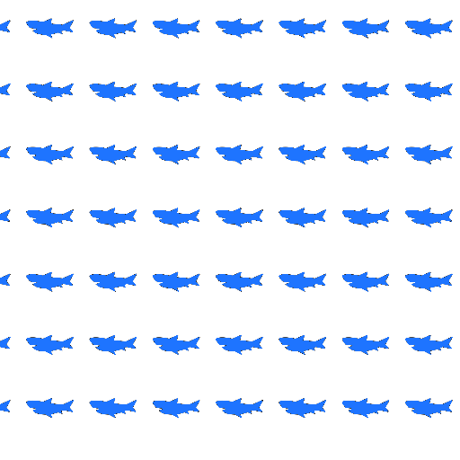
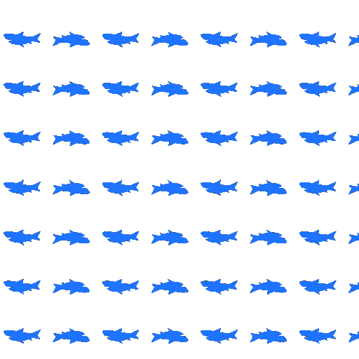
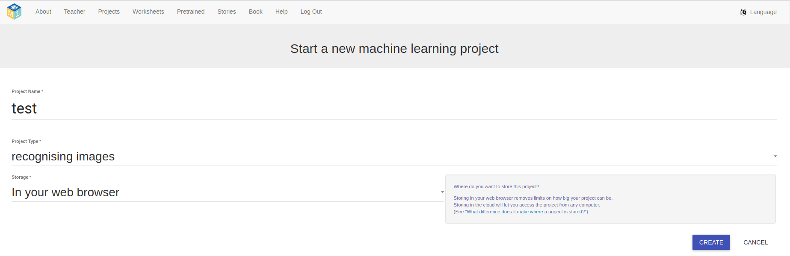
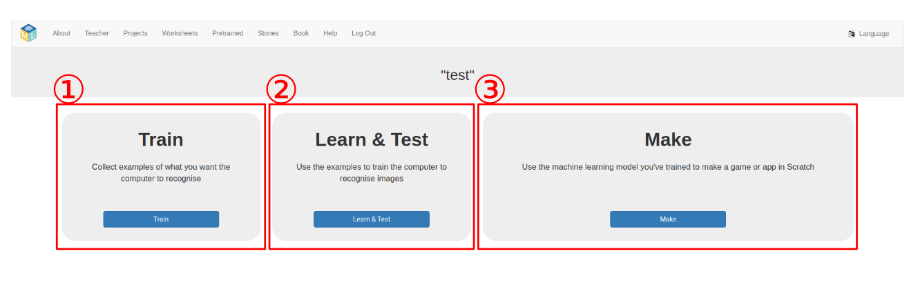
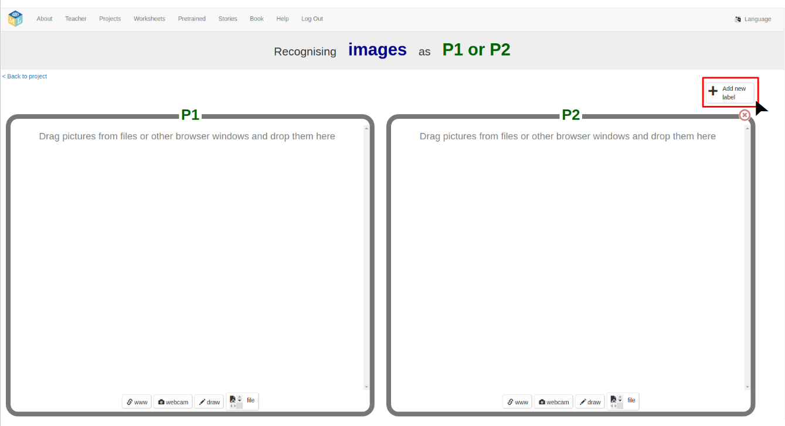
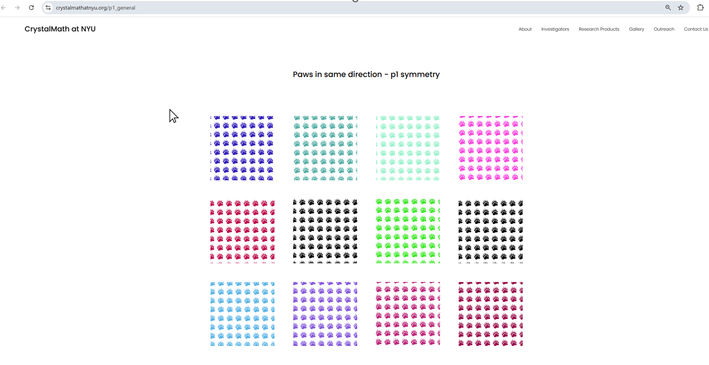
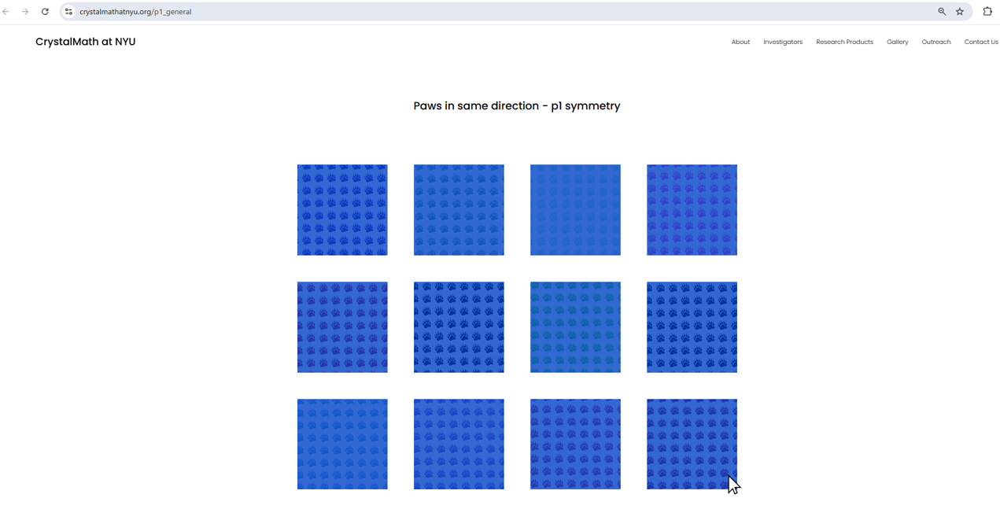
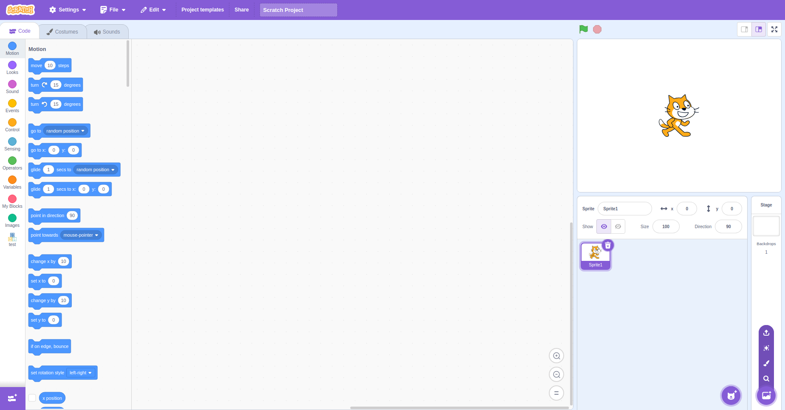
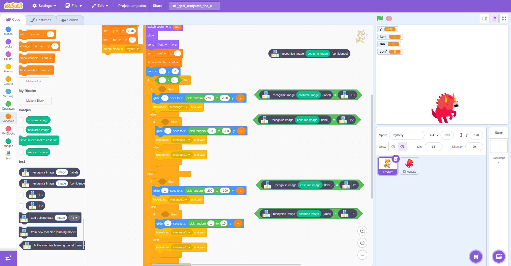

# ML for kids x Scratch - Symmetry Project

Welcome to the Symmetry Explorer! This project helps you learn about symmetry in a fun way using machine learning and colorful patterns.

This project combines [Machine Learning for Kids](https://machinelearningforkids.co.uk) platform and [Scratch](https://scratch.mit.edu/) platform to perform pattern classification. There are three parts to this:

  1. **Understand they Symmetry Group**
  2. **Train your ML using ML for kids**
  3. **Try out using *Scratch*!**

> **What You’ll Do**
> - Train a machine learning model to recognize symmetry patterns
> - Test it in Scratch using colorful images
> - Compare how different training data affects what the computer learns

## Training a machine learning model
Before we use machine learning, let’s learn what symmetry groups are!
A symmetry group is a way to describe how patterns repeat or stay the same when you:

 - flip them (like looking in a mirror),
 - rotate them (like turning a steering wheel),
 - move them (like tiling a floor),
 - or combine them (like flipping and then rotating). 

In total, we have 17 different patterns. Let’s look at two common symmetry groups we’ll be using in this project. Can you spot a difference?

<kbd align="center">

</kbd>
<kbd align="center">

</kbd>

### P1 Symmetry Group — No symmetry
The right picture has P1 symmetry. This pattern doesn’t repeat in any special way. It is just copy of the same pattern like following.

### P2 Symmetry Group  — 180° Rotation Symmetry
The left picture has P2 symmetry.The pattern looks upsode down in the next row. 

### Why does this matter?
These symmetry groups help us understand how patterns repeat — and the goal of this project is to train a computer to tell them apart! This might look easy for us — but not for a computer! We'll teach the computer what to look for and test whether it understands.

## Training a machine learning model
To train an ML model, we use the [Machine Learning for Kids](https://machinelearningforkids.co.uk) platform:
  1. **Log in or sign up:** Visit the [login](https://machinelearningforkids.co.uk/#!/login) page and login, sign up, or just try it without signing up.
  2. **Create a new project:**
     - Navigate to `Projects` in the top menu.
     - Click `add a new project`.
     - Name your project.
     - Choose `recognizing images` as the project type.
     - Select `In your web browser` as storage.
     - Click `CREATE`.
       
The following is the screenshot of the screen. 

<kbd align="center">

</kbd>

  After you hit `CREATE`, you should see the following screen. 
  
<kbd align="center">

</kbd>

  3. **Train the model:**
     - Open the project and go to the `Train` (labeled as ①).
     - Create your classes by clicking `Add new label` at the right-top corner.
     - For this project, we will use P1 and P2.
       

<kbd align="center">

</kbd>

You can drag P1 images from [here](https://www.crystalmathatnyu.org/p1_general) and P2 images from [here](https://www.crystalmathatnyu.org/p2_general) to use for training.
Select all the images at once by dragging your mouse over them, then drag them into the correct class on the ML for Kids page.

Here's how to select and drag the images:

<kbd align="center">

</kbd>

<kbd align="center">

</kbd>

  4. **Train & Test the model:**
     - Go back to the previous page.
     - Click `Learn & Test` (labeled as ②).
     - Training may take some time. If `current model status` appears as **Available**, the model is ready to go. 
     - If `unknown error` occurs, retry by closing the tab and re-training. Clearing browser cache may help.

  5. **Use the trained model in Scratch**
     - Go back to the previous page again.
     - Click 'Make' (labeled as ③).
     - Open `Scratch 3`.
     - Click `Open in Scratch 3` to launch Scratch with ML elements linked to your project.

  You should see the following screen. 

<kbd align="center">

</kbd>

## Writing a *Scratch* program
As a starting point, you can download the *scratch* example code [here](https://github.com/rogalj/dmref-outreach/blob/main/mlforkids/patterns/simpler_figs/dataset/paw_dataset/DK_gen_template_with_paw_all.sb3). (Right-click and choose “Save link as...” if it doesn’t download automatically.)
1. **Load the template project**
   - In Scratch, go to `File -> Load from your computer` to open the example program.
3. **Modify the code:**
   - Add ML elements from the right side of the picture below.
   - Insert `recognise image costume image (confidence)` into the blank space of `set conf to`.
   - Insert 'recognise image costume image = P1` or 'recognise image costume image = P2' into if statement.

<kbd align="center">

</kbd>

## Other datasets
The `dataset` folder contains multiple examples of image classification. The following table summarizes key observations:

| Image | Symmetry Group |Control and Biased training set | # of images used for training | Observation | 
| :-------------: | ------------- |------------- |------------- |------------- |
| Deer| P1 & P2  | Control set: Colored and black-and-white images.  Biased set: Only black-and-white. | 30 | Control classifies color images; biased does not. |
|  Paw | P1 & P2  | Control set: Colored and black-and-white images.  Biased set: Only black-and-white.  | 20 | Control classifies color images; biased does not. |
|   Banana| P1 & P2  | Control set: Regular & 90° rotated images.  Biased set: Only regular images. | 30 | Control classifies rotated images; biased does not. |
|   Horse| P1 & P2  | Control set: Regular & zoomed images.  Biased set: Only regular images. | 60 |Control classifies zoomed images; biased does not. |
|   Shark| P1 & P2  |Control set: Regular & zoomed images.  Biased set: Only regular images. | 30 | Control classifies zoomed images; biased does not. |
|  triangle| P1 & P2  | Control set: Regular, zoomed, rotated images.  Biased set: Only regular images. | 90 | Control classifies zoomed/rotated images; biased does not classify rotated images. |

Try it out and see if it works!! 
 
